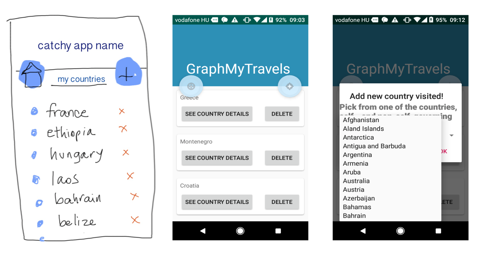
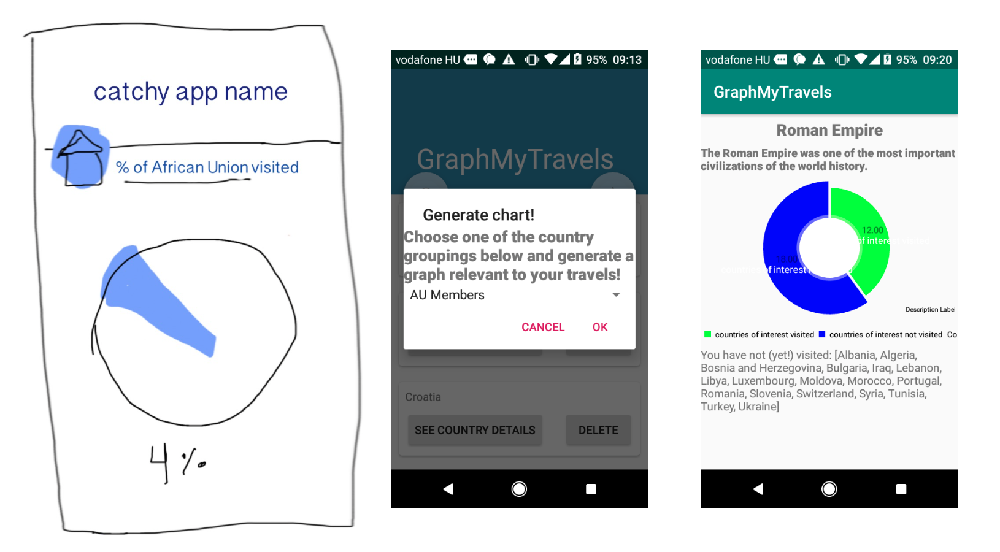

# Mobile Software Applications (Android, Kotlin)

Here are the Android Apps I created during my time at AIT - Budapest during the summer 2019.

## Final Project ("Graph My Travels")
Ever wondered what percent of the EU you've visited? Or maybe you're curious about what countries have visited the moon? If you like graphs and travelling, then this is the app for you!

This app lets you:
1. Keep track of the countries you've visited
2. Learn about countries you've visited and others next up on your list
3. Generate graphs about your travels!

Learn more by going through my final presentation [here](https://docs.google.com/presentation/d/1HMFX6_oniUfgFYdRG8X1p1M6tl4ABr0K2a8ccdnV0cQ/edit?usp=sharing)!

## Other projects

### Minesweeper
Created a game app where you can play Minesweeper with three levels of difficulty.

### Weather App
Get the weather plus other stats about your favorite cities!

### Shopping List
Keep track of items you need to pick up at the supermarket with this app!
